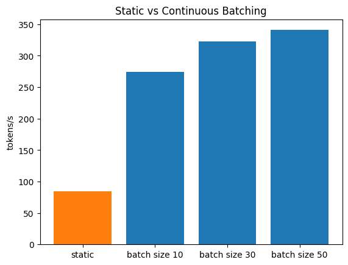

## tachyon

a LLM inference engine to run on consumer hardware.

1. each request has its own state and you can choose to disable or enable kv cache on a request level.
2. supports continous batching where the decode step is batched to max out gpu, and requests get recycled as soon as it is completed from the active batch to allow new requests to enter the batch.
3. the prefill step is batched using a smaller batch size to avoid OOMs
4. vectorized operations to improve batch performance.
5. prefix caching to save on expensive prefill computation when there is shared system prompts or few shot examples etc.
5. 3 lines to invoke the engine and run inference!

## Usage

1. first download the weights for llama 1B.

```
hf_hub_download(
    repo_id=f"meta-llama/Llama-3.2-1B-Instruct",
    filename="model.safetensors",
    local_dir=f"Llama-3.2-1B-Instruct"
)
```

2. invoke the engine.

```
from tachyon.engine.llm import Engine
engine = Engine("meta-llama/Llama-3.2-1B-Instruct")
print(engine.generate_text("Explain AGI")) # for single request

#for multiple requests
outputs = engine.generate_text([
    "Explain AGI",
    "What is vLLM?",
    "Tell me about SGLang"
])

for o in outputs:
    print(o)
```

3. benchmark script

```
python3 benchmark.py
```

### current benchmarks(rtx 4060 ti 16GB)
| implementation | tokens generated | time taken | tok/s |
|---|---|---|---|
| naive torch | 3031 | 233.171 s | 13 tok/s |
| naive torch with kv cache | 3200 | 37.771 s | 84.72 tok/s |
| static batching | 31309 | 369.081 s | 84.83 tok/s |
| continuous batching (bs=10) | 30600 | 111.657 s | 274.05 tok/s |
| continuous batching (bs=30) | 29000 | 89.755 s | 323.10 tok/s |
| continuous batching (bs=50) | 29800 | 87.442 s | 340.80 tok/s |
| continuous batching (bs=50) with vectorized ops and batched prefill | 30500 | 71.731 s | 425.20 tok/s |
| prefix caching with similar requests | 36100 | 54.469 s | 662.76 toks/s | 



### to-do

- [x] implement llama 3 family model.
- [x] make it into a serving engine.
- [x] write a benchmark script and check latency and throughput.
- [x] add kv cache.
- [x] continous batching
- [x] prefix caching
- [ ] test the effect of torch compile (open PR, come back to this) 
- [ ] paged attention
- [ ] more techniques